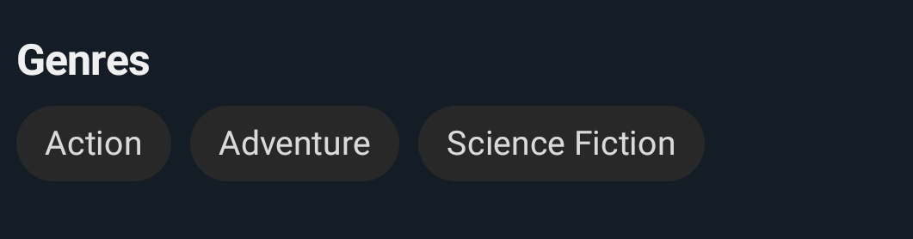

# HorizontalChipView

A custom ChipGroup showing a title and chips in horizontal orientation by being able to specify a
name for each chip.

## HorizontalChipView in XML layout

We can use `HorizontalChipView` without any customized attributes. This `HorizontalChipView` will be
initialized with the default parameters and **without title**.

```xml
<com.indisparte.horizontalchipview.HorizontalChipView 
    android:id="@+id/chipGroup"
    android:layout_width="match_parent" 
    android:layout_height="wrap_content" />
```   

## Attribute descriptions

We can customize the view using the below attributes.

```xml
 <com.indisparte.horizontalchipview.HorizontalChipView
    android:id="@+id/chipGroup"
    android:layout_width="match_parent"
    android:layout_height="wrap_content"
    app:title="Title" //title of section
    app:titleColor="@color/white" //title color, default white
    app:titleSize="18sp" //title size, default 14sp
    app:titleStyle="bold"  //title style, default bold
    app:titleTypeface="@font/my_font" /> // title font
```   

## Add chips into `HorizontalChipView`

To add chips inside our view we need to use the following method:

```kotlin
//other code...
val genres: List<Genre>

override fun onViewCreated(view: View, savedInstanceState: Bundle?) {
    super.onViewCreated(view, savedInstanceState)
    //bind the custom view
    val chipGroup: HorizontalChipView<Genre> =
        view.findViewById<HorizontalChipView<Genre>>(R.id.chiGroup)

    //set all the elements
    chipGroup.setChipsList(
        genres,//The list of items to be included in the chip group
        textGetter = { genre -> genre.name }//The text to be included in the chip
    )
    
    //optional : specify the action on chips click
    chipGroup.onChipClicked = { genre ->
        Toast.makeText(
            requireContext(),
            "${genre.name} genre",
            Toast.LENGTH_SHORT
        ).show()
    }
    //other code
}
```

## Screenshots



