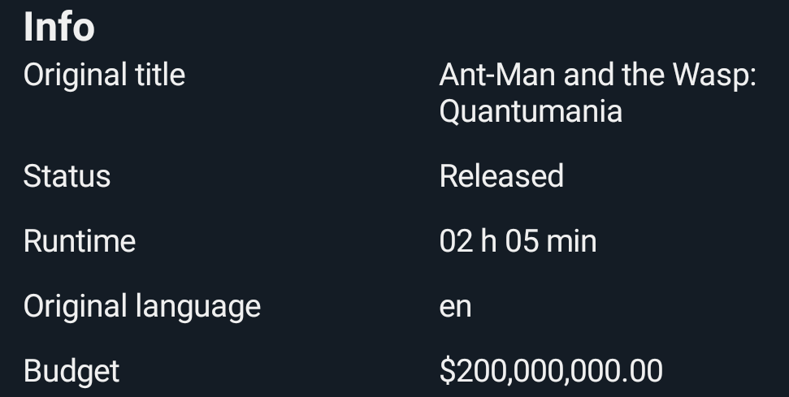

# LinearLayoutInfo

A custom LinearLayout view that displays a title and value, allowing the view to be automatically hidden when the value is null

## LinearLayoutInfo in xml layout

We can use `LinearLayoutInfo` in this way , showing a title and a value. If the value is empty we can hide the view

```xml
 <com.indisparte.linearlayoutinfo.LinearLayoutInfoView
    android:id="@+id/originalTitle"
    android:layout_width="match_parent"
    android:layout_height="wrap_content"
    android:layout_marginBottom="10dp"
    app:hideIfValueEmpty="true"
    app:textColor="@color/white"
    app:textSize="14sp"
    app:title="Original title"
    app:value="Title" />
 ```    

## Attributes description:

We can customize the view using the below attributes.

```xml
 <com.indisparte.linearlayoutinfo.LinearLayoutInfoView
    android:id="@+id/originalTitle"
    android:layout_width="match_parent"
    android:layout_height="wrap_content"
    android:layout_marginBottom="10dp"
    app:hideIfValueEmpty="true"//default false, hide view if value is empty
    app:textColor="@color/white"
    app:textSize="14sp"
    app:textTitleStyle="bold" //default bold
    app:textValueStyle="normal" //default normal
    app:title="Original title"
    app:value="Title" />
```  

## Screenshots


