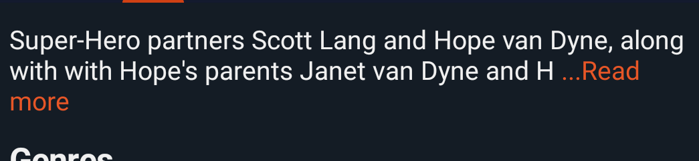

# MoreLessTextView

A custom TextView that allows you to truncate text that exceeds a specified number of lines, displaying customizable clickable text that allows you to expand the entire text.

## MoreLessTextView in XML layout

We can use `MoreLessTextView` without any customized attributes. This `MoreLessTextView` will be
initialized with the default parameters and show all text

```xml
<!-- Code here -->
```    

## Attributes description:

```xml
<!-- Code here -->
``` 

## Screenshots



