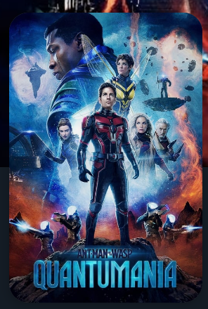

# PosterView

A custom PosterView that allows a media poster to be displayed indicating the title and a rating, if any. Title and rating can be null, the view in this case will hide them

## PosterView in XML layout

We can use `PosterView` without any customized attributes. This `PosterView` will be
shown only image.

```xml
<!-- Code here -->
```    

## PosterView attributes:

We can customize the view using the below attributes.

```xml
<!-- Code here -->
```  

## Screenshots





