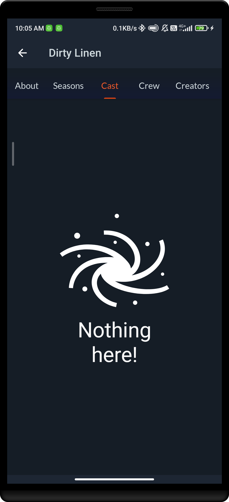

# RecyclerViewEmptyStateSupport

A custom RecyclerView that allows you to show an empty state when it contains no elements

## RecyclerViewEmptyStateSupport in XML layout

We can use `RecyclerViewEmptySupport` without any specific attributes, 
this will behave like a normal RecyclerView by simply showing an "_Empty Result_" label with an icon 
in case there are no items in the RecyclerView.

```xml
<com.indisparte.recyclerviewemptystatesupport.RecyclerViewEmptyStateSupport 
    android:id="@+id/recyclerView"
    android:layout_width="match_parent"
    android:layout_height="match_parent" />
```    

## RecyclerViewEmptyStateSupport attributes:

We can customize the view using the below attributes.

```xml
<com.indisparte.recyclerviewemptystatesupport.RecyclerViewEmptyStateSupport 
    android:layout_width="match_parent"
    android:layout_height="match_parent"
    app:emptyText="Nothing here!" // Default is Empty Result
    app:icon="@drawable/ic_space" // Another icon as default
    app:iconWidth="100dp" //Default 200dp
    app:iconHeight="100dp" // Default 200dp
    app:emptyTextColor="@color/alabaster" // Default is white
    app:emptyTextSize="14sp" //Default is 18sp 
    app:emptyTextStyle="bold"// Default bold
    app:emptyTextTypeFace="@font/myfont" // Default null
    />
```   

## Screenshots


